# Scan-to-HBIM Framework

**AI-Assisted Automation of the Scan-to-HBIM Process for Cultural Heritage**

An open-source framework for converting 3D point cloud scans of heritage structures into semantically enriched HBIM (Historic Building Information Models) using cloud-based automation.

[](https://opensource.org/licenses/MIT)
[](https://www.python.org/downloads/)
[](https://colab.research.google.com/github/hilalslasenturk/alaca-cesme-hbim)

---

## Overview

This framework provides a complete pipeline for:
1. **Loading** raw point cloud data (.ply, .las, .e57)
2. **Preprocessing** with voxel downsampling and outlier removal
3. **Feature extraction** using geometric descriptors (Croce et al. 2021)
4. **Segmentation** with DBSCAN clustering
5. **Classification** using Random Forest (99.86% accuracy)
6. **Mesh reconstruction** with Poisson surface reconstruction
7. **IFC export** with semantic property sets

### Key Features

- **99.86% Classification Accuracy** using Y_normalized feature
- **IFC4 Schema** with IfcTriangulatedFaceSet geometry
- **3 Semantic Property Sets** for heritage documentation
- **Cloud-native** architecture (GCS + n8n + Colab)
- **Fully automated** pipeline (except Revit visualization)

---

## Architecture

### Cloud Infrastructure

```mermaid
flowchart LR
    subgraph Input
        A[👤 User] -->|Upload .ply| B[(☁️ GCS)]
    end

    subgraph Orchestration
        B <-->|Trigger| C[⚡ n8n]
        C <-->|Execute| D[📓 Colab]
    end

    subgraph Processing
        D --> E[Phase 1: Load]
        E --> F[Phase 2: Preprocess]
        F --> G[Phase 3: Features]
        G --> H[Phase 4: Segment]
        H --> I[Phase 5: Classify]
        I --> J[Phase 6: Mesh]
        J --> K[Phase 7: IFC]
    end

    subgraph Output
        K -->|Export| L[(☁️ GCS)]
        L -->|Download| M[📦 IFC File]
        M -->|Manual| N[🏛️ Revit]
    end

    style A fill:#e1f5fe
    style B fill:#fff3e0
    style C fill:#f3e5f5
    style D fill:#e8f5e9
    style N fill:#fce4ec
```



### Pipeline Flow

```mermaid
flowchart TB
    subgraph Phase1[" 1️⃣ Load "]
        A1[Raw Point Cloud<br>.ply / .las / .e57] --> A2[Validate & Load]
    end

    subgraph Phase2[" 2️⃣ Preprocess "]
        A2 --> B1[Voxel Downsampling<br>0.01m]
        B1 --> B2[SOR Outlier Removal]
        B2 --> B3[Normal Estimation]
    end

    subgraph Phase3[" 3️⃣ Features "]
        B3 --> C1[Geometric Features<br>9 per scale × 3 scales]
        C1 --> C2[Position Features<br>X, Y, Z normalized]
        C2 --> C3[30 Total Features]
    end

    subgraph Phase4[" 4️⃣ Segment "]
        C3 --> D1[DBSCAN Clustering<br>eps=0.05m]
    end

    subgraph Phase5[" 5️⃣ Classify "]
        D1 --> E1[Random Forest<br>100 trees]
        E1 --> E2[🎯 99.86% Accuracy<br>Y_normalized key feature]
    end

    subgraph Phase6[" 6️⃣ Mesh "]
        E2 --> F1[Poisson Reconstruction<br>depth=10]
        F1 --> F2[Per-element Trimming]
    end

    subgraph Phase7[" 7️⃣ IFC "]
        F2 --> G1[IFC4 Schema]
        G1 --> G2[Semantic Property Sets]
        G2 --> G3[📄 Final IFC Model]
    end

    style Phase1 fill:#e3f2fd
    style Phase2 fill:#e8f5e9
    style Phase3 fill:#fff3e0
    style Phase4 fill:#fce4ec
    style Phase5 fill:#f3e5f5
    style Phase6 fill:#e0f2f1
    style Phase7 fill:#fffde7
    style E2 fill:#c8e6c9,stroke:#2e7d32,stroke-width:2px
```



---

## Pipeline Phases

| Phase | Description | Output |
|-------|-------------|--------|
| 1. Load | Load & validate point cloud | `01_raw/` |
| 2. Preprocess | Voxel, SOR, Normal estimation | `02_preprocessed/` |
| 3. Features | 30 geometric features + Y_normalized | `03_features/` |
| 4. Segment | DBSCAN clustering | `04_segmentation/` |
| 5. Classify | Random Forest (99.86%) | `05_classification/` |
| 6. Mesh | Poisson reconstruction | `06_mesh/` |
| 7. IFC | Semantic IFC4 export | `07_ifc/` |

---

## Quick Start

### Option 1: Google Colab (Recommended)

1. Open any notebook in Colab:
   - [01_Load.ipynb](notebooks/01_Load.ipynb)
   - [02_Preprocess.ipynb](notebooks/02_Preprocess.ipynb)
   - etc.

2. Configure GCS bucket name and version
3. Run all cells

### Option 2: Local Installation

```bash
# Clone repository
git clone https://github.com/hilalslasenturk/alaca-cesme-hbim.git
cd alaca-cesme-hbim

# Create virtual environment
python -m venv venv
source venv/bin/activate  # Linux/Mac
# or: venv\Scripts\activate  # Windows

# Install dependencies
pip install -r requirements.txt

# Run pipeline
python src/run_pipeline.py --input your_pointcloud.ply
```

### Option 3: n8n Automation

1. Import `n8n/scan_to_hbim_v6_workflow.json` into n8n
2. Configure GCS credentials
3. Trigger via webhook

---

## Project Structure

```
alaca-cesme-hbim/
│
├── README.md                 # This file
├── LICENSE                   # MIT License
├── requirements.txt          # Python dependencies
├── .gitignore               # Git ignore rules
│
├── notebooks/               # Google Colab notebooks
│   ├── 01_Load.ipynb
│   ├── 02_Preprocess.ipynb
│   ├── 03_Features.ipynb
│   ├── 04_Segment.ipynb
│   ├── 05_Classify.ipynb
│   ├── 06_Mesh.ipynb
│   └── 07_IFC.ipynb
│
├── src/                     # Python source code
│   ├── __init__.py
│   ├── config.py            # Configuration
│   ├── phase1_load.py
│   ├── phase2_preprocess.py
│   ├── phase3_features.py
│   ├── phase4_segment.py
│   ├── phase5_classify.py
│   ├── phase6_mesh.py
│   ├── phase7_ifc.py
│   └── run_pipeline.py      # Full pipeline runner
│
├── n8n/                     # n8n workflow exports
│   └── scan_to_hbim_v6_workflow.json
│
├── config/                  # Configuration files
│   ├── heritage_metadata.json
│   └── .env.example
│
├── docs/                    # Documentation
│   ├── METHODOLOGY.md
│   ├── GCS_SETUP.md
│   └── N8N_SETUP.md
│
└── examples/                # Example outputs
    └── sample_ifc/
```

---

## Heritage Classes

| Class | Turkish | IFC Entity | Description |
|-------|---------|------------|-------------|
| zemin | Zemin | IfcSlab | Ground/floor surface |
| seki | Seki | IfcSlab | Marble platform |
| ana_cephe | Ana Cephe | IfcWall | Main facade wall |
| kemer | Kemer | IfcBuildingElementProxy | Arch structure |
| sacak | Saçak | IfcRoof | Cornice/eaves |

---

## Semantic Property Sets

### Pset_YapiKimligi (Building Identity)
- YapiAdi, YapimTarihi, HicriTarih, Donem, Bani, YapiTipi, Konum

### Pset_ElemanBilgisi (Element Information)
- ElemanAdi_TR, ElemanAdi_EN, IFCSinifi, VertexSayisi, UcgenSayisi

### Pset_KorumaDurumu (Conservation Status)
- TescilDurumu, SonRestorasyon, MevcutDurum, OzgunIslev, GuncelIslev

---

## Key Achievement: Y_normalized Feature

The **Y_normalized** feature (depth from facade) is the key to achieving 99.86% classification accuracy:

```python
# Y coordinate distinguishes elements by depth
y_coords = points[:, 1]
y_normalized = (y_coords - y_coords.min()) / (y_coords.max() - y_coords.min())

# Kemer (arch): Y ≈ 0.3-0.5 (front)
# Ana Cephe (wall): Y ≈ 0.1-0.3 (back)
# Seki (platform): Y ≈ 0.6-0.8 (very front)
```

---

## Case Study: Alaca Çeşmesi

This framework was developed and tested on **Alaca Çeşmesi** (Alaca Fountain), a 16th-century Ottoman fountain in Istanbul:

- **Construction Date:** 1586 (H.995)
- **Period:** Classical Ottoman (III. Murad)
- **Location:** Eyüpsultan, Istanbul, Turkey
- **Raw Points:** 9.2 million
- **Final IFC Size:** ~80 MB

---

## Requirements

- Python 3.8+
- Open3D 0.17+
- NumPy, SciPy, scikit-learn
- ifcopenshell
- google-cloud-storage (for cloud execution)

See [requirements.txt](requirements.txt) for full list.

---

## References

1. **Croce, V. et al. (2021)** - "From Survey to Semantic Representation for Cultural Heritage", ISPRS Int. J. Geo-Inf.

2. **Poux, F. (2025)** - "3D Data Science with Python"

3. **Gil, J. et al. (2024)** - Heritage ML comparison study

---

## License

This project is licensed under the MIT License - see [LICENSE](LICENSE) file.

---

## Citation

If you use this framework in your research, please cite:

```bibtex
@software{scan_to_hbim_2026,
  author = {Şentürk, Hilal Sıla},
  title = {Scan-to-HBIM Framework: AI-Assisted Automation for Cultural Heritage},
  year = {2026},
  url = {https://github.com/hilalslasenturk/alaca-cesme-hbim}
}
```

---

## Contact

- **Author:** Hilal Sıla Şentürk
- **Email:** hilalslasenturk@gmail.com
- **University:** Ankara Yıldırım Beyazıt Üniversitesi

### Supervisors

- **Dr. Öğr. Üyesi Cemile Feyzan Şimşek** - Thesis Advisor
- **Öğr. Gör. Dr. Ömer Faruk Pamak** - Co-Advisor

---

*Developed as part of Master's Thesis: "AI-Assisted Automation of the Scan-to-HBIM Process for Cultural Heritage: Development of an Open Framework"*
